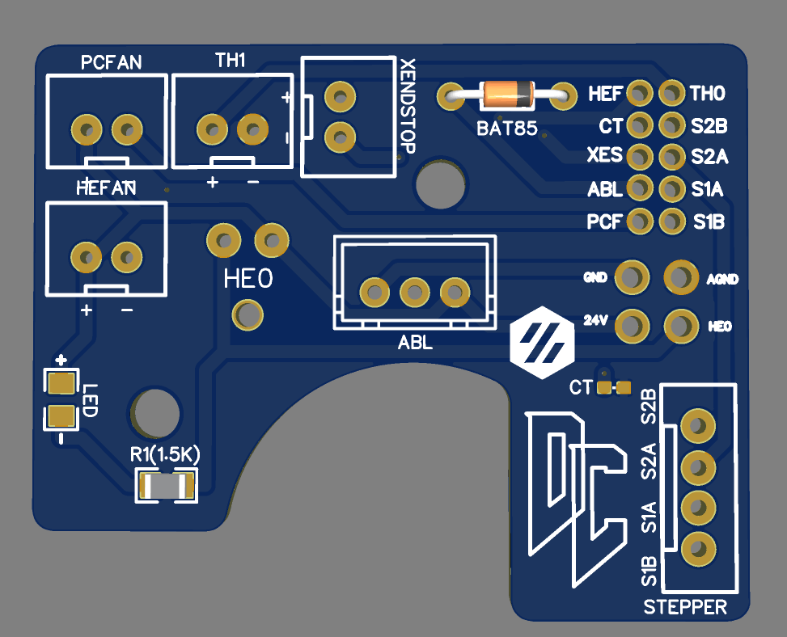

# Afterburner Toolhead Board #

# NOTE: THERE A A FEW DIFFERENT VERSIONS OF THIS BOARD, THE WIRING DIAGRAM IS FOR THE MOST CURRENT VERSION. IF YOU BOUGHT A VERSION FROM ME ON THE FLEA MARKET AND HAVE ANY QUESTIONS DM ME ON DISCORD

## The board has: ##
 - BAT85 Diode for abl probe
 - Indicator LED to show when hotend is on
 - 2/3/4 pin headers for most components on the toolhead
 - 2 Pin Microfit 3.0 for the heater
 - 0402 pkg thermistor to be used as a chamber temperature 
 - 14 Pin Microfit 3.0 for the main connector back to the MCU 
  
This board was designed to make wiring the toolhead a bit easier, to help get rid of some of the crimps needs on these wires. 

Since this board has provisions for the X endstop, this should be compatible with V1, V2, and Switchwire

