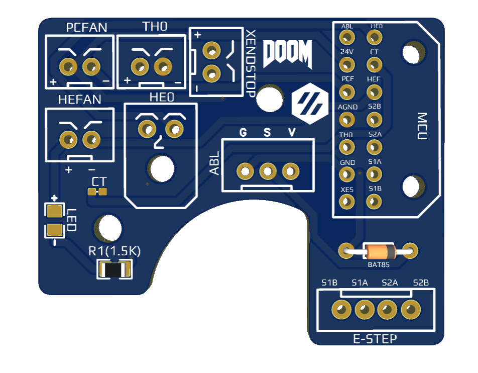
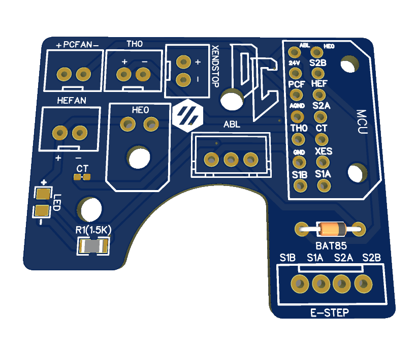

# Afterburner Toolhead Board #

### NOTE: THERE ARE A FEW DIFFERENT VERSIONS OF THIS BOARD GOING AROUND, 3.0 and 3.1, BOTH WIRING DIAGRAMS WILL BE UPLOADED HERE SHORTLY 

## This is 3.1 -

 [Here](Images/Rev3.1/wiringDiagram.png) is the wiring diagram

## This is 3.0

 [Here](Images/Rev3.0/wiringDiagram.png) is the wiring diagram

## The board has: ##
 - BAT85 Diode for abl probe
 - Indicator LED to show when hotend is on
 - 2/3/4 pin headers for most components on the toolhead
 - 2 Pin Microfit 3.0 for the heater
 - 0402 pkg thermistor to be used as a chamber temperature 
 - 14 Pin Microfit 3.0 for the main connector back to the MCU 
  
This board was designed to make wiring the toolhead a bit easier, to help get rid of some of the crimps needs on these wires. 

Since this board has provisions for the X endstop, this should be compatible with V1, V2, and Switchwire

