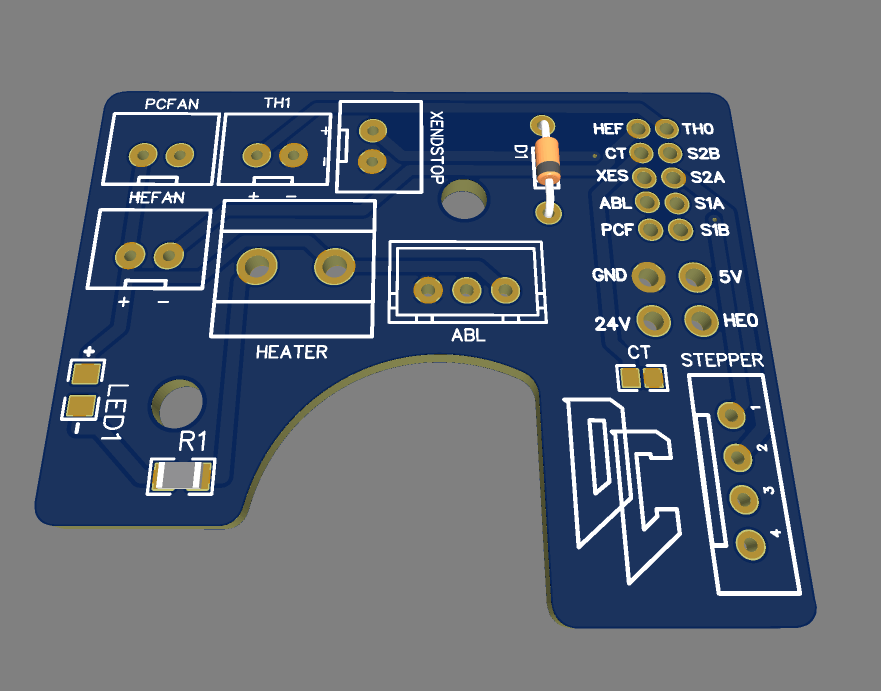

# Afterburner Toolhead Board #

## The board has: ##
 - BAT85 Diode for abl probe
 - Indicator LED to show when hotend is on
 - 2 pin headers for most components on the toolhead
 - Screw terminals for heater
 - 0402 pkg thermistor to be used as a chamber temperature 
  
This board was designed to make wiring the toolhead a bit easier, to help get rid of some of the crimps needs on these wires. 

