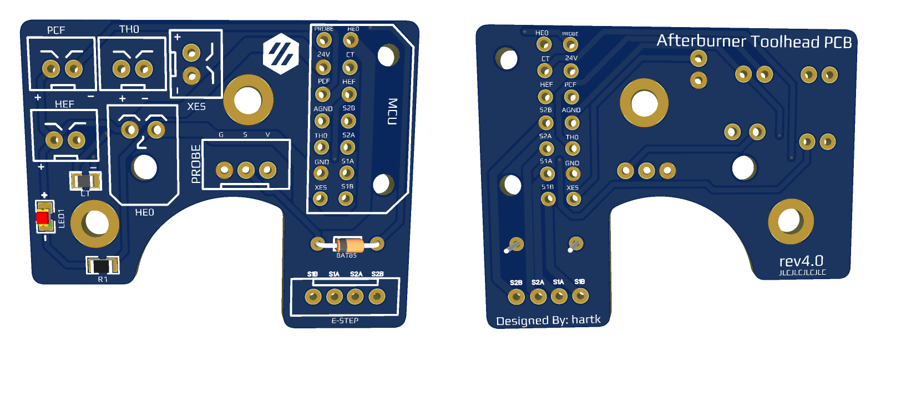
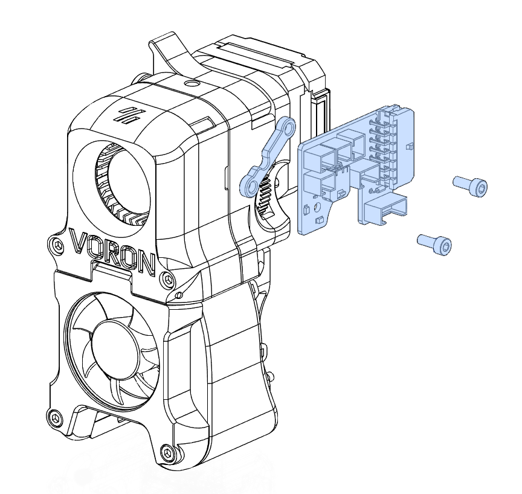

# Afterburner Toolhead Board #

### 4.0 IS NOT COMPATIBLE WITH SPIDER/OCTOPUS IF YOU USE DIFFERENT FAN VOLTAGES. IF YOU WANT TO USE A DIFFERENT VOLTAGE FAN, THE ERCF IS THE BOARD YOU WOULD WANT TO USE.

### If you are using 3.2 or older please use some sort of m3 plastic washer when mounting the PCB 

## NEWEST VERSION 4.0

#### note: the bat85 diode has been rotated 180 deg for v4 , so double check that it is in the correct orientaion on your board 

 [Here](Images/Rev3.2/wiringDiagram.png) is the wiring diagram
 
    Pinout 
    24V  - HE0 +V 
    GND  - PSU -V (NOT MAINS GND)
    PROBE/ABL  - Probe Signal Pin
    HE0  - Hotend Heater -V
    CT   - Chamber Thermistor Signal Pin (TH1)
    PCF  - Part Cooling Fan -V
    HEF  - Hotend Cooling Fan -V
    AGND - Hotend Thermistor -V
    TH0  - Hotend Thermistor Signal Pin (TH0)
    XES  - X Endstop Signal Pin 
    S1A  - Red Stepper Wire
    S2A  - Green Stepper Wire
    S1B  - Blue Stepper Wire
    S2B  - Black Stepper Wire 

## The board has: ##
 - BAT85 Diode for abl probe
 - Indicator LED to show when hotend is on
 - 2/3/4 pin headers for most components on the toolhead
 - 2 Pin Microfit 3.0 for the heater
 - 0805 pkg thermistor to be used as a chamber temperature 
 - 14 Pin Microfit 3.0 for the main connector back to the MCU 
 - the main wiring harness connector is [Here](https://www.molex.com/molex/products/part-detail/crimp_housings/0430251400)
 - 20awg should be fine for 24v, GND, and HE0 and 24awg for everything else 
  
This board was designed to make wiring the toolhead a bit easier, to help get rid of some of the crimps needs on these wires. 

Since this board has provisions for the X endstop, this should be compatible with V1, V2, and Switchwire

### chamber thermistor config settings for SKR1.4 connected to TH1
 ## Config for 3.2,4.0,4.1,ERCF
    #######################################
    #### Enclosure Temp Sensor Section ####
    #######################################
    [thermistor chamber_temp]
    temperature1: 25
    resistance1: 10000
    beta: 3950
    
	
	[temperature_sensor enclosure_temp]
    sensor_type: chamber_temp
    sensor_pin: P0.23
    min_temp: 0
    max_temp: 100
    gcode_id: C
	

 ## Config for 3.0-3.1
    #######################################
    #### Enclosure Temp Sensor Section ####
    #######################################
    [temperature_sensor enclosure_temp]
    sensor_type: NTC 100K beta 3950
    sensor_pin: P0.23
    min_temp: 0
    max_temp: 100
    gcode_id: C

### Changes for the ERCF version
 there are now solder jumpers on the back to select 24v or 5v for fans and probes. the fan and probe jumpers are defaulted to 24v if you want a different voltage you will need to cut the trace and solder the other side
 

### Here is how the board and PCB spacer get installed using 2 M3x8 SHCS

