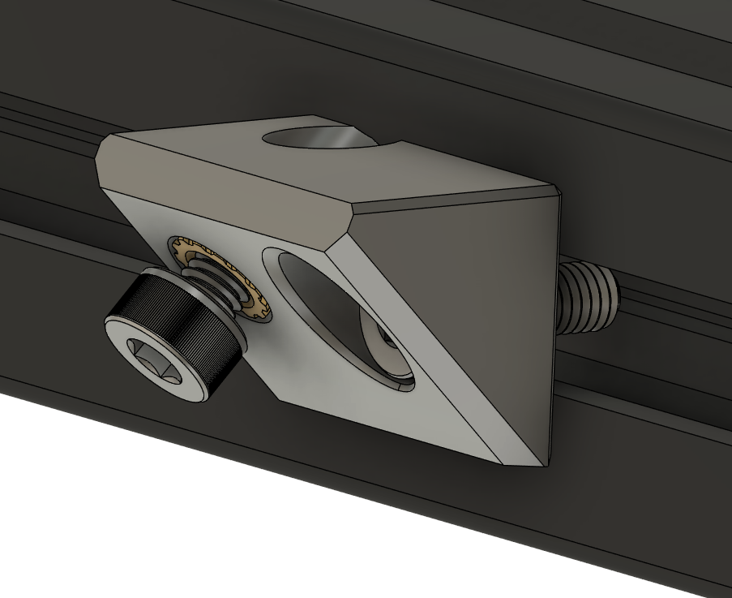
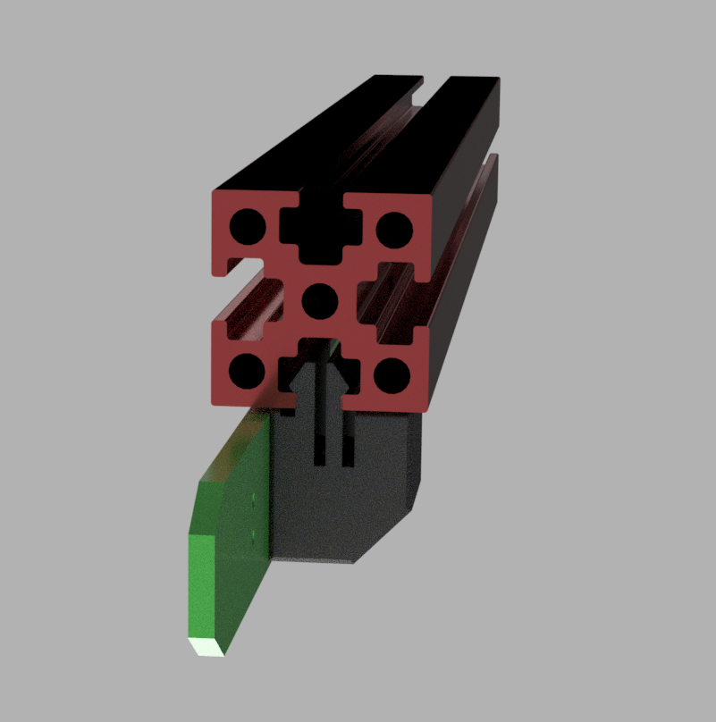

# Daylight on a stick


The original Daylight on a Stick is a chainable 24V LED bar, to be used with high quality 4000K LEDs to give the illusion of daylight in your Voron. Great when making photo's of your prints, or want to see the colors how they will look in the outside world.  

Ideally popuplated with 90+ CRI LEDs (3V, ~60mA), but currently LCSC does not carry those, so the BOM has 80 CRI ones. Just as bright, bit less accurate color reproduction. Would advice to use the proper ones for the intended experience.  
So if you solder them yourself, get better leds, for example:  
[Digikey CRI90+](https://www.digikey.com/en/products/detail/JB2835AWT-W-U40GA0000-N0000001/2138-JB2835AWT-W-U40GA0000-N0000001CT-ND/10820479)  
[AliExpress CRI95+](https://www.aliexpress.com/item/4000389792048.html) (non affiliate link)

Use any angled 2.54mm(0.1") connector such as a 90 degree pinheader, angled JST-XH or Molex KK254.

The RGB versions use any 4 pin 5050 package addressable led, like the known WS2812B, the SK6812 (with or without white) etcetera. Also 100nF capacitors in 0805 package are added to decouple the leds.

## Varieties

- [Daylight on a Stick](./Daylight_on_a_stick/) (for Voron sizes of 250mm and upwards)
- [Daylight on a Matchstick](./Daylight_on_a_matchstick/) (for V0.1 or other printers for ants)
- [Disco on a Stick](./Disco_on_a_stick/) (RGB addressable LEDs for the big printers)
- [Rainbow on a Matchstick](./Rainbow_on_a_matchstick/) (RGB addressable LEDS for the small printers)

## Klipper
Use the regular Daylight on a Stick/Matchstick directly on 24V or hook them up to a spare heater output on your controlboard. In this last case you can control it using:

```
[output_pin daylight]
pin: ##PIN##
pwm: True
cycle_time: 0.01
```

For the RGB ones, put them on the RGB output of your controlboard and configure them according to the [Klipper config reference](https://www.klipper3d.org/Config_Reference.html#neopixel). `chain_length` is 18 for the big stick, 10 for the matchstick.

## Mounting

The [bracket for 2020 profiles](./STL/Brackets_2020.stl) are mounted to the profile using an M3x6 or M3x8 SHCS together with a roll-in nut, and take an M3 heat insert to mount the strip onto the bracket itself.  


  
On 1515 frames like the V0.1 the [brackets for 1515 profiles](./STL/Brackets_1515_x2.stl) are used. They take an M3 heat insert and clip into the extrusion. Mount the pcb on them with an M3x6 BHCS screw.
The clip geometry used in these was developed by [Zruncho for their ZeroPanels](https://github.com/zruncho3d/ZeroPanels).  
  
