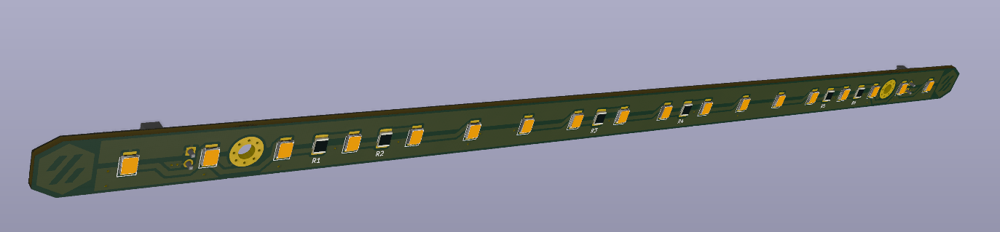

# Daylight on a stick



Chainable 24V LED bar to be used with high quality 4000K LEDs to give the illusion of daylight in your Voron.  

Ideally popuplated with 90+ CRI LEDs (3V, ~60mA), but currently LCSC does not carry those, so the BOM has 80 CRI ones. Just as bright, bit less accurate color reproduction.  
If you solder them yourself, get better leds, for example:  
[Digikey CRI90+](https://www.digikey.com/en/products/detail/JB2835AWT-W-U40GA0000-N0000001/2138-JB2835AWT-W-U40GA0000-N0000001CT-ND/10820479)  
[AliExpress CRI95+](https://www.aliexpress.com/item/4000389792048.html) (non affiliate link)

Use any angled 2.54mm(0.1") connector such as a 90 degree pinheader, angled JST-XH or Molex KK254.

## Klipper
Use the Daylight on a stick directly on 24V or hook them up to a spare heater output on your controlboard. In this last case you can control it using:

```
[output_pin daylight]
pin: ##PIN##
pwm: True
cycle_time: 0.01
```