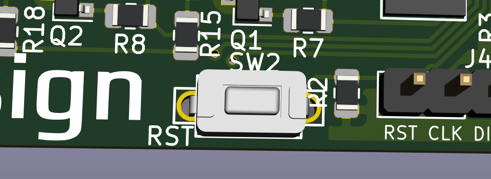
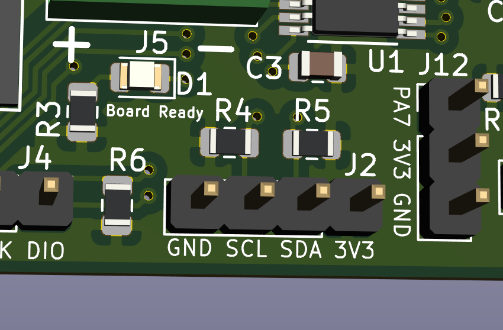
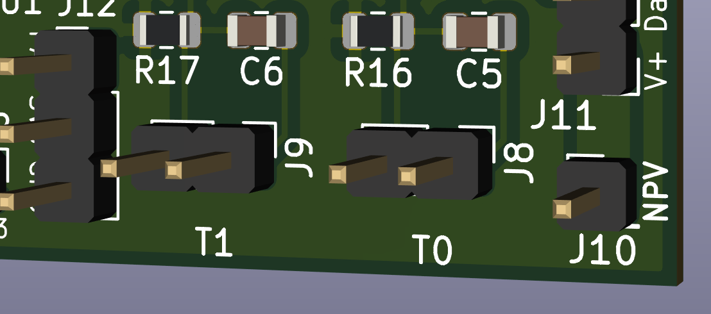
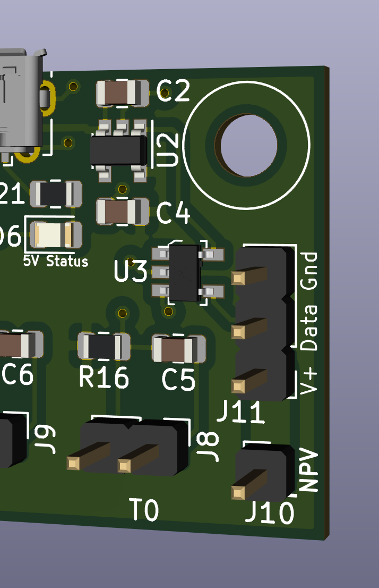

Welcome to your new Klipper Expander! This document outlines the common features of the board that you are likely to use. 
There is a companion [Advanced](KlipperExpanderAdvancedInfo.md) that goes into some more detail

- Indicator LEDs

	There are 3 status indicator LEDs on the board:
	- 5v Status near the USB port indicates that there is 5V present and feeding the board
	- Board Ready near the IC indicates that the board is communicating with Klipper
	- Vin status indicates that there is power present on the Vin and GND feeding the board through the screw terminals
	There are 4 more indicator LEDs near each of the MOSFETs and screw terminals, these indicate if the MOSFET is enabled

	\


- Switch

	There is one switch, labeled RST. This resets the board

	\


- I2C Header

	Contains a 3.3V I2C bus for connecting displays, and other sensors such as environemntal sensors and breakout expanders.
	This plugs into J2

	\


	Example display configuration:
	```
	[display]
	lcd_type: sh1106
	i2c_bus: i2c1a
	```

- Power In

	Vin and GND are for feeding power to the Mosfets, this can be any voltage under 50V

	\

- Fuse

	The fuse is a micro blade type fuse and should be chosen to the maximum draw of all of the MOSFET fed devices.

	For example, if you are running a 40W heater, 2 5W fans and 1 2W fan, you will need a total of 62W of power.
	At 24V, this would translate to 62W/24V = 2.58A. The closest fuse might be a 5A fuse, which you should use.

	\


- Mosfets

	4 x 4 Amp mosfets fopr controlling LED's, Heater, Fans, and other accessories
	Connected to pins PA0, PA1, PA2 and PA3

	


	Example configuration:
	```
	[output_pin mosfet0]
	pin: PA0
	value: 0
	shutdown_value: 0
	```

- Thermistors

	2 thermsitor inputs that use a 4.7K pullup resistor (Klipper default)
	Connected to pins PA5 and PA6

	


	Example configuration for a standalone thermistor (Not tied to a bed or hotend)
	```
	[temperature_sensor t0]
	sensor_type: ATC Semitec 104GT-2
	sensor_pin: PA5
	gcode_id=10
	```

- Neopixel header

	Header for using neopixels. there is a single power input pin (NPV) that you can supply with the voltage your struip needs (5V/12V) and it passes it to the three pin header (Vin,Data,Ground)
	Connected to J1, which has a NPV supplied voltage, GND and PB1

	

	Example configuration:
	```
	[neopixel Pixel]
	pin: PB1
	chain_count: 1
	initial_RED: 0.9
	initial_GREEN: 0.3
	initial_BLUE: 0.0
	```
