Welcome to your new Klipper Expander! This document outlines the common features of the board that you are likely to use. 

<!-- TOC -->

- [Basic](#basic)
    - [Indicator LEDs](#indicator-leds)
    - [Switch RST](#switch-rst)
    - [I2C Header PF0, PF1](#i2c-header-pf0-pf1)
    - [Power In](#power-in)
    - [Fuse](#fuse)
    - [Mosfets PA0, PA1, PA2, PA3](#mosfets-pa0-pa1-pa2-pa3)
    - [Thermistors PA5, PA6](#thermistors-pa5-pa6)
    - [Neopixel header PB1](#neopixel-header-pb1)
- [Setup](#setup)
- [Advanced](#advanced)
    - [Boot Jumper](#boot-jumper)
    - [SWD header PA13, PA14, RST](#swd-header-pa13-pa14-rst)
    - [GPIO PA7](#gpio-pa7)
- [Testing](#testing)
- [Debugging](#debugging)
    - [Basic troubleshooting:](#basic-troubleshooting)
- [FAQ](#faq)
    - [Why do I want this?](#why-do-i-want-this)
    - [How do I get one?](#how-do-i-get-one)

<!-- /TOC -->

# Basic

First we will go through the basic functionality of the board that most users will be looking for

## Indicator LEDs

There are 3 status indicator LEDs on the board:
- 5v Status near the USB port indicates that there is 5V present and feeding the board (D6)
- Board Ready near the IC indicates that the board is communicating with Klipper (D1)
- Vin status indicates that there is power present on the Vin and GND feeding the board through the screw terminals (D7)
- 4 indicator LEDs (D2-D5) near each of the MOSFETs and screw terminals, these indicate if the MOSFET is enabled

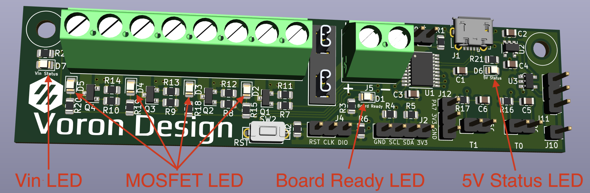\


## Switch (RST)

There is one switch, labeled RST. This resets the board

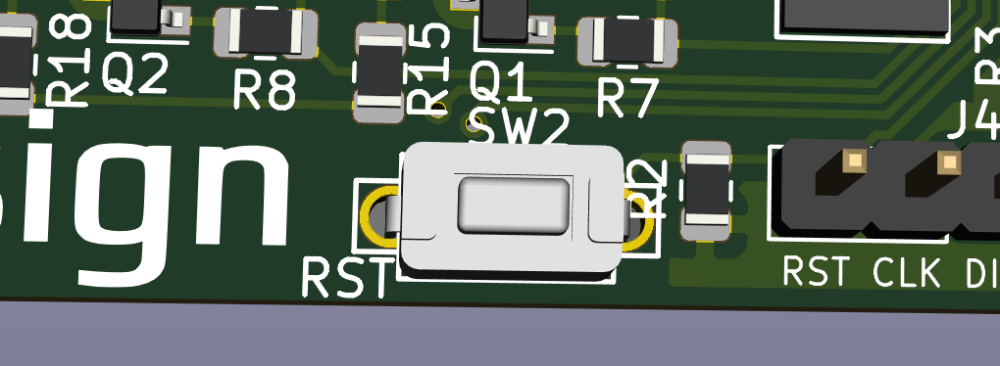\


## I2C Header (PF0, PF1)

Contains a 3.3V I2C bus for connecting displays, and other sensors such as environemntal sensors and breakout expanders.
This plugs into J2

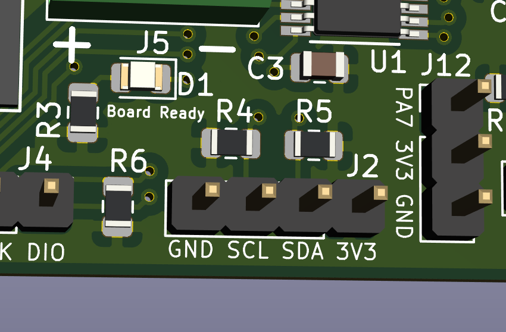

Both SCL and SDA pins are pulled up to 3V3 with a 4.7k resistor

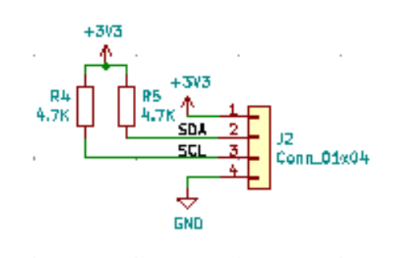

Example display configuration:
```
[display]
lcd_type: sh1106
i2c_bus: i2c1a
```

## Power In

Vin and GND are for feeding power to the Mosfets, this can be any voltage under 50V

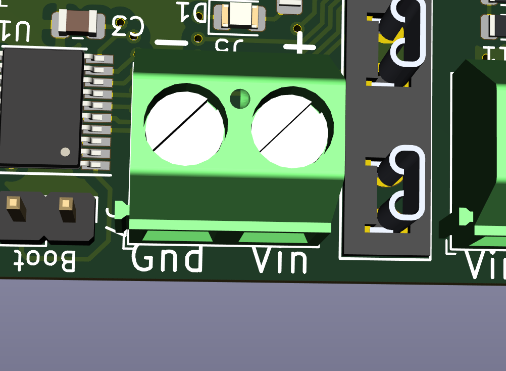

## Fuse

The fuse is a micro blade type fuse and should be chosen to the maximum draw of all of the MOSFET fed devices.

For example, if you are running a 40W heater, 2 5W fans and 1 2W fan, you will need a total of 62W of power.
At 24V, this would translate to 62W/24V = 2.58A. The closest fuse might be a 5A fuse, which you should use.

Maximum power should not exceed 12A as the MOSFETs are each rated to a maximum of 3A.

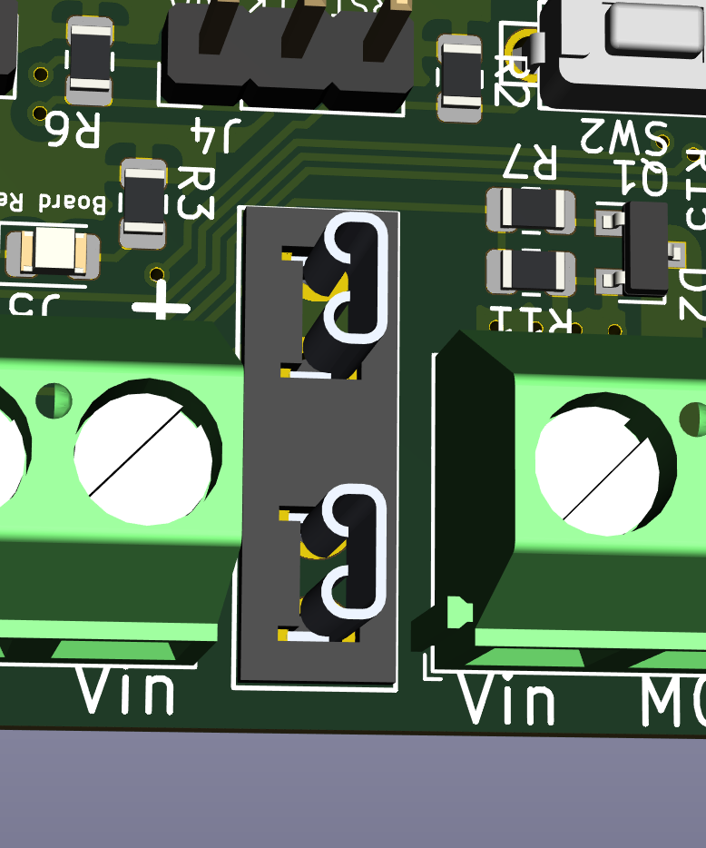


## Mosfets (PA0, PA1, PA2, PA3)

4 x 4 3A Amp mosfets fopr controlling LED's, Heater, Fans, and other accessories
Connected to pins PA0, PA1, PA2 and PA3

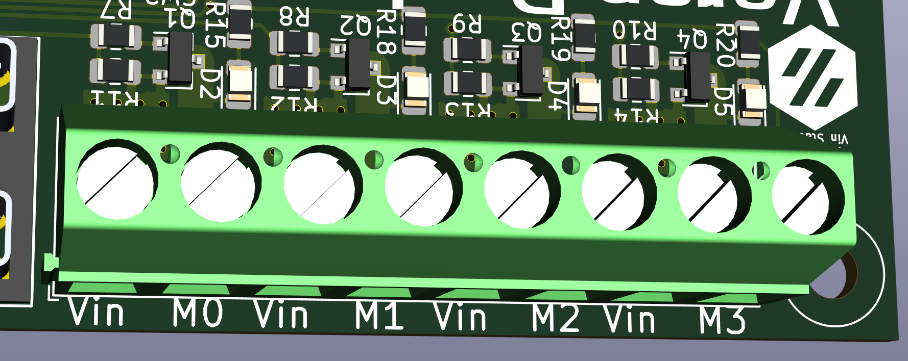


Example configuration:
```
[output_pin mosfet0]
pin: PA0
value: 0
shutdown_value: 0
```

## Thermistors (PA5, PA6)

2 thermsitor inputs that use a 4.7K pullup resistor (Klipper default)
Connected to pins PA5 and PA6

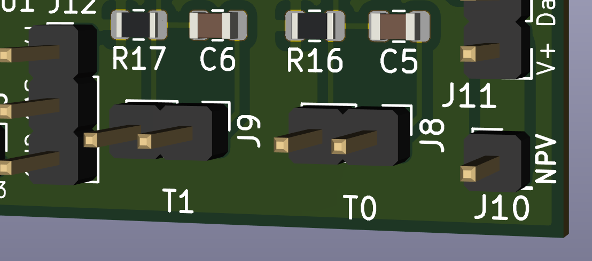


Example configuration for a standalone thermistor (Not tied to a bed or hotend)
```
[temperature_sensor t0]
sensor_type: ThermistorType
sensor_pin: PA6
gcode_id: T0
```

```
[temperature_sensor t1]
sensor_type: ThermistorType
sensor_pin: PA5
gcode_id: T1
```

## Neopixel header (PB1)

Header for using neopixels. there is a single power input pin (NPV) that you can supply with the voltage your struip needs (5V/12V) and it passes it to the three pin header (Vin,Data,Ground)
Connected to J1, which has a NPV supplied voltage, GND and PB1

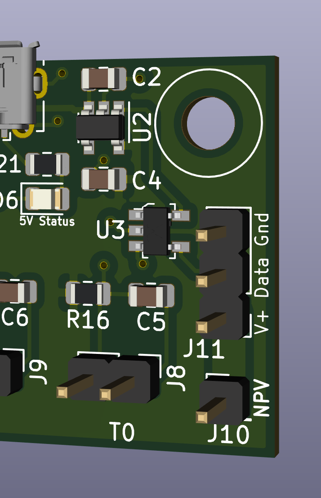

Example configuration:
```
[neopixel Pixel]
pin: PB1
chain_count: 1
initial_RED: 0.9
initial_GREEN: 0.3
initial_BLUE: 0.0
```

# Setup

If you purchased your board from someone in the Voron community this is likely already completed, however if you are building it yourself you will need to go through these steps

1) Connect the board to the host Raspberry Pi via USB.

2) This step depends on if your board has firmware on it or not already:

	a) If you have a pre-flashed board:
		-Install the boot jumper and reset the board. This will put the board into DFU mode.
	
	b) If you have an unflashed board:
		- The MCU default's to DFU mode if there is no other firmware installed.
		
	 - confirm the board enters DFU mode in step 4
	
3) Connect to your host raspberry pi via SSH

4) Run `lsusb` from the command prompt
	- Make sure you see an STM32 in DFU mode listed
	
5) Run `dfu-util --list` from the command prompt
	- note the text inside the [xxxx:yyyy]
	
6) Remove the boot jumper.

7) Run `cd ~/klipper` from the command line to enter the Klipper directory

8) Run `make menuconfig` settings should be:


	Exit and Save
9) Run `make clean` to clean up the make environment.

10) Run `make flash FLASH_DEVICE=xxxx:yyyy` (using xxxx:yyyy from above)

11) After completion `ls /dev/serial/by-id/*` should return a device begining with `/dev/serial/by-id/usb-Klipper_stm32f042x6...`

Your board should now be usable with Klipper. Use the example config files to get started
Best optioon is to copty the config you want to use into the same directory as `printer.cfg` then add `[include NAME_OF_CONFIG.CFG]` to the end of your `printer.cfg` to include the file.

# Advanced
Here are some more advanced features and details about the board

## Boot Jumper

This jumper needs to be installed to put the board in DFU mode to flash with klipper firmware. The board will show up as "Device in DFU Mode" to `lsusb` and then should show up in `dfu-util --list`

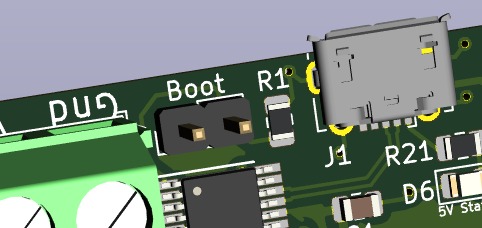


## SWD header (PA13, PA14, RST)

This header is used if you SOMEHOW manage to brick the device beyond a BOOT jumper reset.

* https://stm32-base.org/guides/connecting-your-debugger.html

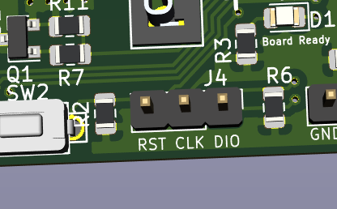


## GPIO (PA7))

The GPIO header J12 (PA7,3V3,GND) is available for creative uses. 
	
Examples of what this can be used for include external mosfet, relay or a door open sensor

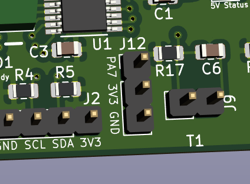

PA7 is connected directly to the STM32 with no pullups

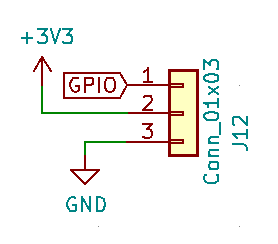


# Testing

Included configuration file [](../Software/standalone.cfg) will allow you to startup the Expander without another MCU to validate all features are functional.

You will need the following devices:
- Power supply (5V is easiest)
- 4 x devices for MOSFET that will work at Power supply voltage
- Neopixel with appropriate dupont headere (WS2812b for 5V or WS2811 for 12V)
- Display like this one: [Adafruit OLED Display](https://www.adafruit.com/product/931)
- 2 Thermistors with dupont or JST headers
- Raspberry Pi or another computer running Klipper

Use the [Example](../Software/standalone.cfg) confiugration supplied in this repository

When the Expander starts up you should see:
- All 3 Status LEDs light up
- None of the MOSFETs light up
- Neopixel will be orange
- Display will have 3d printer typical display

Other steps:
- Run a M105 to get temperature readings
- Execute the [test.gcode](../Software/test.gcode) file to cycle through the MOSFET pins

# Debugging

Sometimes problems happen, here is how you can fix them

## Basic troubleshooting:

* Set in DFU mode and reflash
* Remove unused sections in `printer.cfg`
* Disconnect devices and test

# FAQ

## Why do I want this?

The Expander gives you extra connectivity that suppliments your main MCU(s) without the cost and size of a full board. Also you can use an Expander to run devices at a different voltage than the main MCU. i.e. Noctua fans are 12V where the main MCU is 24V

## How do I get one?

Included in this repository are [Production Files](../Production_Files) which you can use to order from [JLCPCB](https://jlcpcb.com) or anywhere else you order boards from. Alternatively, on the Voron Discord you may find someone selling one preassembled if you post in #flea-market
