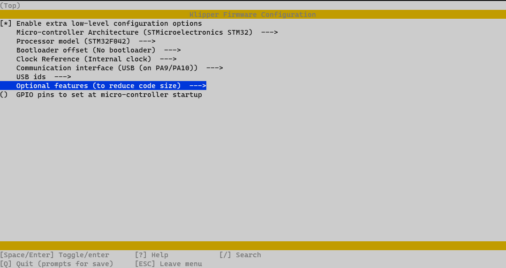
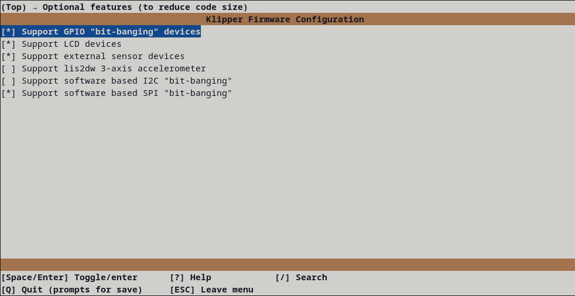

## Klipper Expander Flashing Instructions:

1) Connect the board to the host Raspberry Pi via USB.

2) Connect to your host raspberry pi via SSH.
	
3) Install the boot jumper and reset the board. This will put the board into DFU mode.

4) Run `lsusb` from the command prompt
	- Make sure you see an STM32 in DFU mode listed
	
5) Run `dfu-util --list` from the command prompt
	- note the text inside the [xxxx:yyyy]

6) Run `cd ~/klipper` from the command line to enter the Klipper directory

7) Run `make menuconfig` settings should be:

	

	- Set the "Optional features" to:

	

	- Hit `Q` to Exit and Save

8) Run `make clean` to clean up the make environment.

9) Run `make flash FLASH_DEVICE=xxxx:yyyy` (using xxxx:yyyy from above)

10) Remove the boot jumper and press the reset button.

11) After completion `ls /dev/serial/by-id/*` should return a device begining with `/dev/serial/by-id/usb-Klipper_stm32f042x6...` 

12) Copy this serial port name (`/dev/serial/by-id/usb-Klipper_stm32f042x6...`) and place it in your [mcu expander] section of the config file.

Your board should now be usable with Klipper. Use the example config file to get started
Best option is to copy the example config file into the same directory as `printer.cfg` then add `[include klipperExpander.cfg]` to the end of your `printer.cfg` to include the file.
