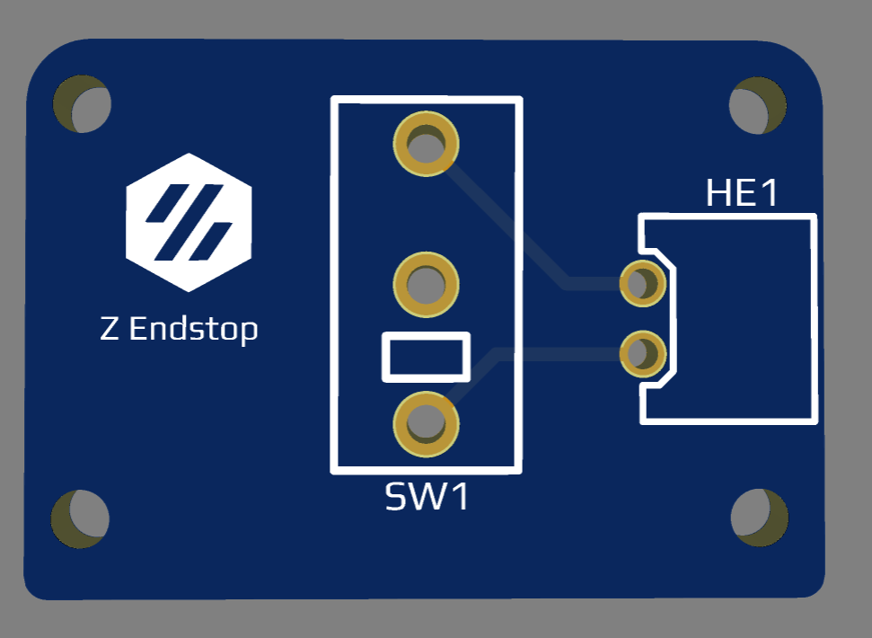
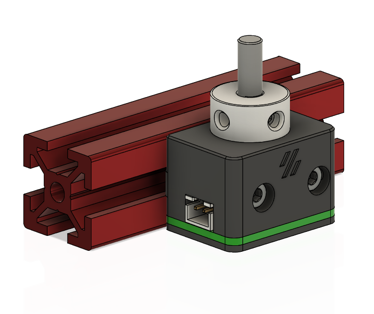

# Microswitch Z Endstop PCB  #

## The board has: ##
 - 1 Omron D2F microswitch
 - 1 90deg 2 pin jst/ or 90deg 2 pin dupont 
  
This board was designed to make wiring the z endstop a bit easier. 

