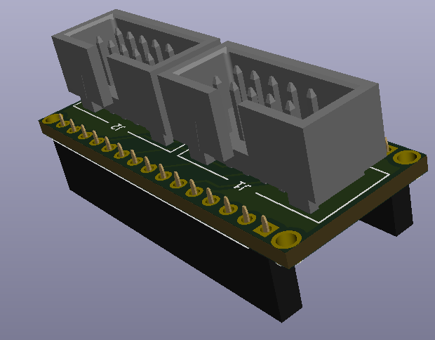

# Nano Display Adaptor

Arduino Nano compatable board to control a RepRap or Fysetc display

This board maps an Arduino nano's pins onto the 2 2x5 pin IDC cables needed for a RepRapDiscount Smart Controller, RepRapDiscount Full Graphic Smart Controller or Fysetc Mini 12864 Controller.

 This work is licensed under a <a rel="license" href="http://creativecommons.org/licenses/by-nc/3.0/us/">Creative Commons Attribution-NonCommercial 3.0 United States License</a>.
