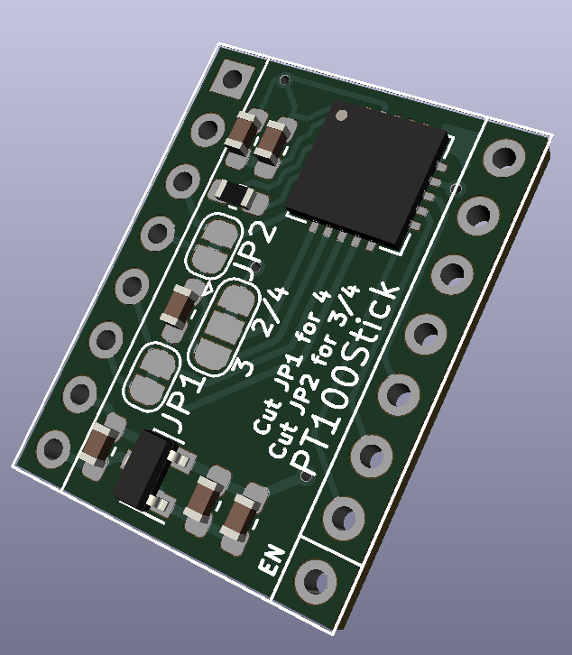

# PT100Stick

The PT100 Stick is a Pololu formfactor MAX31865 breakboard for SKR 1.3/1.4 and similar 32 bit 3D printer control boards. It requires that the control board can be configured to use SPI in the same layout at the Big Tree Tech TMC2130 Stepsticks and powers stepsticks with 3.3 volts.

[Interactive bom](http://htmlpreview.github.io/?https://github.com/VoronDesign/Voron-Hardware/blob/master/PT100Stick/Docs/ibom.html)