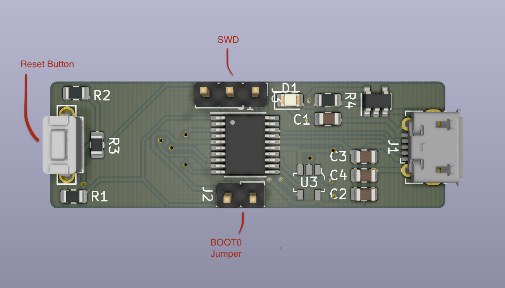

# FAQ

## What is this?

This is a dedicated board to drive a [FYSETC Mini 12864 Display](https://github.com/FYSETC/Mini-12864-Panel). It's intended to run the [Klipper](https://github.com/KevinOConnor/klipper) firmware.

## Why?

The intention is to reduce the number of wires to connect your display to your VORON. No ribbon cables are required, you can plug this directly onto the back of your screen and then use a single microUSB cable to your Raspberry Pi.

## Doesn't the Nano Display board do something similar?

The [Nano Display](https://github.com/VoronDesign/Voron-Hardware/tree/master/Nano_Display) came first, and yes, it does a similar thing. And yeah, it's easier to build, and it's likely cheaper. It's not a bad option.

# Setup Guide

## Physical Setup

If you received a kit, ensure to solder the Reset button and BOOT0 jumper headers. You likely won't need the SWD headers.

Do not jump the BOOT0 pins during normal operation mode. It is used only when putting the board into DFU mode to flash a new firmware.

## Firmware Compilation

When compiling klipper, use the following options:

    │ ┌─────────────────────────────────────────────────────────────────────┐ │
    │ │    [*] Enable extra low-level configuration options                 │ │
    │ │        Micro-controller Architecture (STMicroelectronics STM32)  ---│ │
    │ │        Processor model (STM32F042)  --->                            │ │
    │ │        Bootloader offset (no bootloader)  --->                      │ │
    │ │        Clock Reference (Internal clock)  --->                       │ │
    │ │        Communication interface (USB (on PA9/PA10))  --->            │ │
    │ │        USB ids  --->                                                │ │
    │ │        Optional features (to reduce code size)  --->                │ │
    │ │    ()  GPIO pins to set at micro-controller startup                 │ │
    │ │                                                                     │ │
    │ └─────────────────────────────────────────────────────────────────────┘ │

Optional features (to reduce code size): (Klipper >= v0.13)

    │ ┌─────────────────────────────────────────────────────────────────────┐ │
    │ │    [*] Support micro-controller based ADC (analog to digital)       │ │
    │ │    [*] Support communicating with external chips via SPI bus        │ │
    │ │    [*]      Support software based SPI "bit-banging"                │ │
    │ │    [*] Support communicating with external chips via I2C bus        │ │
    │ │    [*]      Support software based I2C "bit-banging"                │ │
    │ │    [*] Support GPIO based button reading                            │ │
    │ │    [*] Support Trinamic stepper motor driver UART communication     │ │
    │ │    [*] Support 'neopixel' type LED controller                       │ │
    │ │    [*] Support measuring fan tachometer GPIO pins                   │ │
    │ │        *** LCD chips ***                                            │ │
    │ │    [*] Support ST7920 LCD display                                   │ │
    │ │    [*] Support HD44780 LCD display                                  │ │
    │ │        *** Accelerometer chips ***                                  │ │
    │ │    [ ] Support adxl accelerometers                                  │ │
    │ │    [ ] Support lis2dw and lis3dh 3-axis accelerometers              │ │
    │ │    [ ] Support MPU accelerometers                                   │ │
    │ │    [ ] Support ICM20948 accelerometer                               │ │
    │ │        *** External ADC type chips ***                              │ │
    │ │    [ ] Support thermocouple MAX sensors                             │ │
    │ │    [ ] Support HX711 and HX717 ADC chips                            │ │
    │ │    [ ] Support ADS 1220 ADC chip                                    │ │
    │ │        *** Other external sensor chips ***                          │ │
    │ │    [ ] Support ldc1612 eddy current sensor                          │ │
    │ │    [ ] Support angle sensors                                        │ │
    │ └─────────────────────────────────────────────────────────────────────┘ │

Note that when switching between MCU architectures it is important to run "make clean" before a "make". This prevents any strange build errors.

    make clean
    make

## Firmware Flashing

Start by putting the board into DFU mode: Jump the BOOT0 pins and perform a reset. Now remove the jumper.

Now flash the firmware

    make flash FLASH_DEVICE=0483:df11

Ignore the errors thrown at the end.

Hit the reset button again. You are now running Klipper.

## Klipper Configuration

A sample Klipper configuration can be found here: [klipper-mini12864.cfg](./klipper-mini12864.cfg)

Download the file and include it as part of your existing config through an include:

    [include klipper-mini12864.cfg]

Don't forget to update the MCU's serial path

## Finishing Up

Ensure the BOOT0 headers do not have the jumper installed, then perform a klipper firmware restart.

You should now be ready to go.
Enjoy, and don't forget to report any issues or suggestions.
