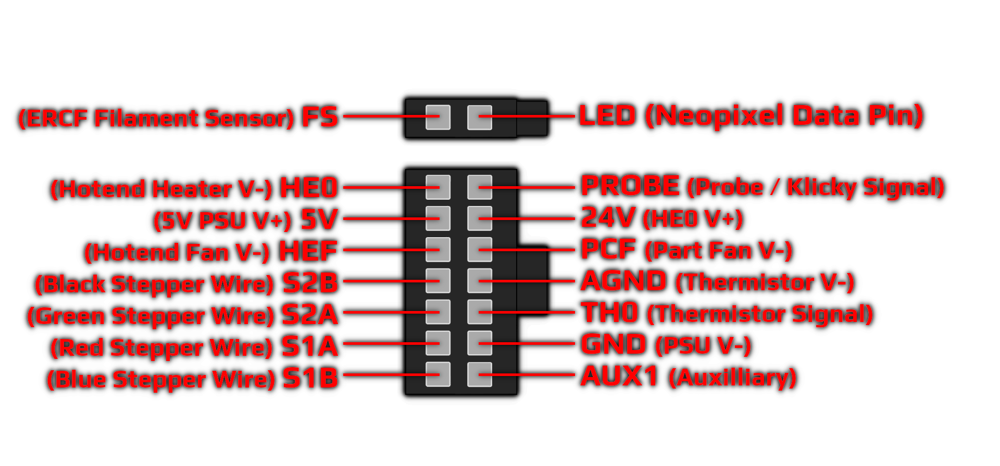
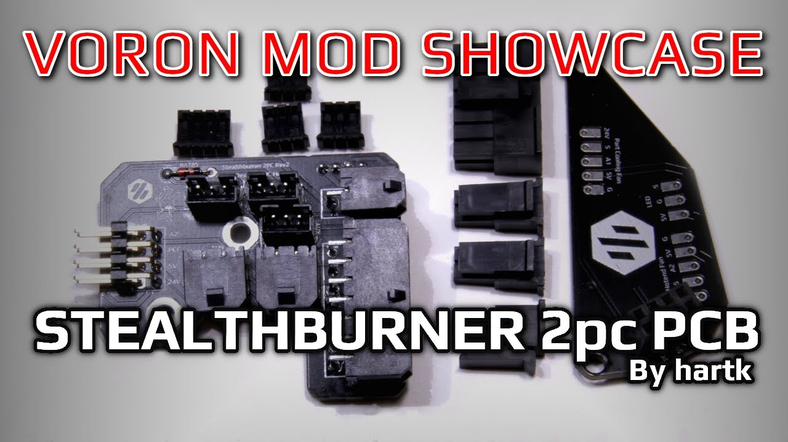
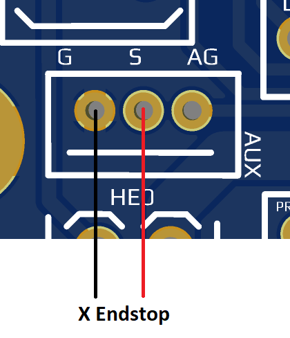
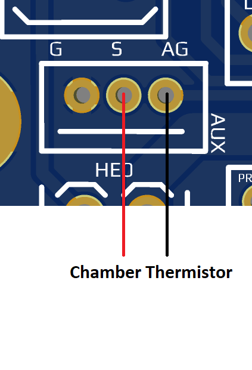
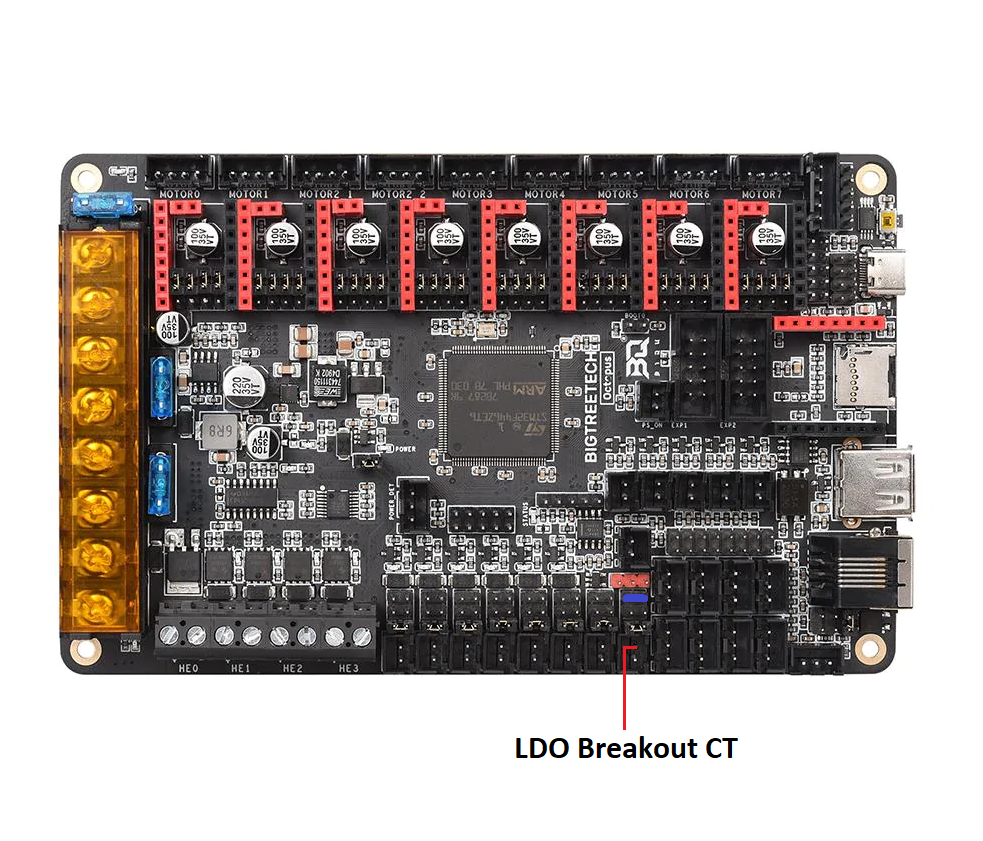
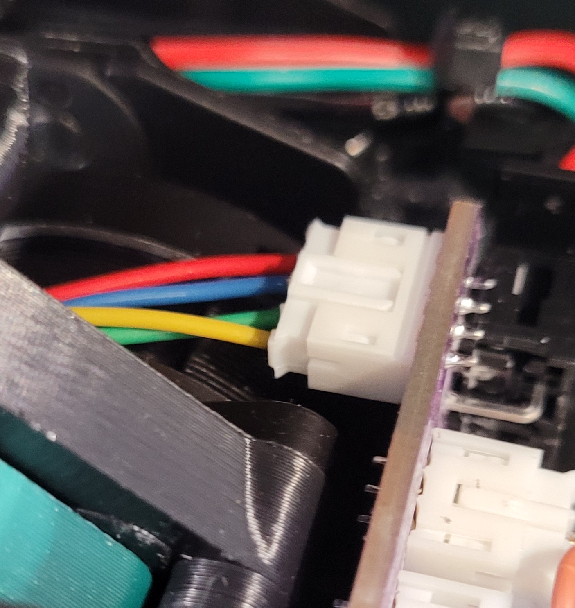
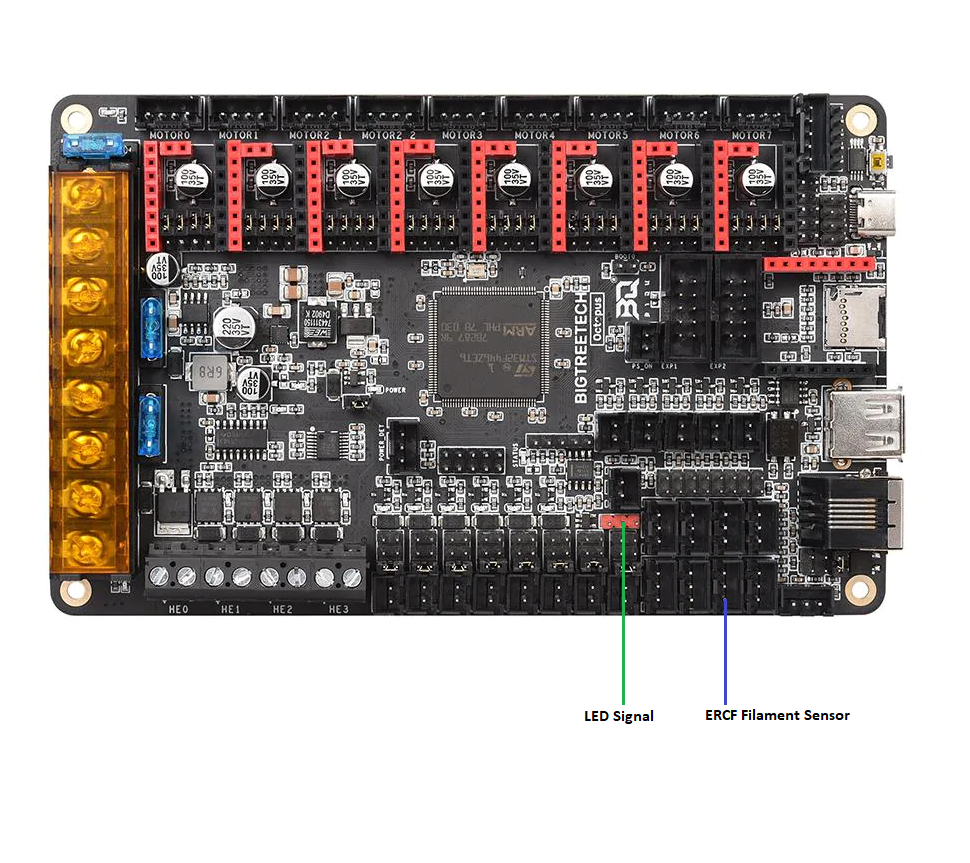
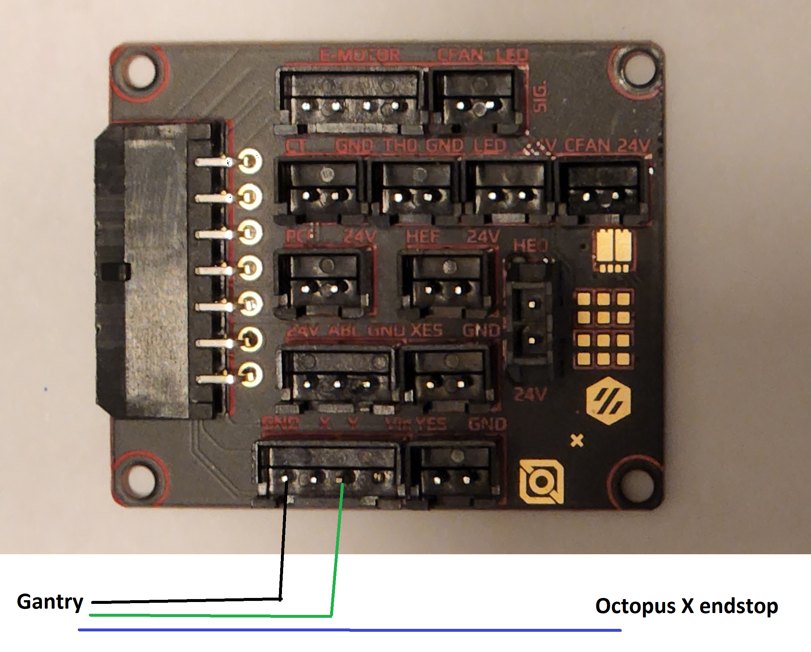
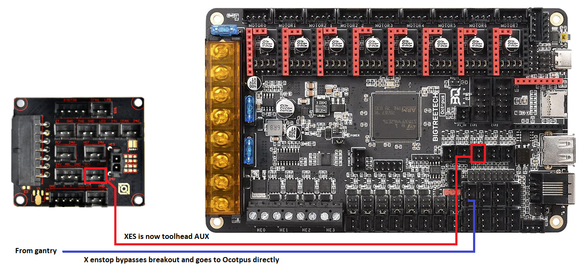

# Stealthburner Toolhead Board #

## Update Revision 4

both the standard and 2pc boards have been updated

* 5v header is now available next to the 24v probe header
* stepper wiring has now been fixed
* updated the schematics to match the current boards as well 

This is the update to the Afterburner toolhead board for the CW2 extruder and Stealthburner 
# BOM standard version [here](Production%20Files/StealthburnerPCB/Standard)
| Item | Qty |
| :------------: |----:| 
| Molex 436500200 | 2 |
| Molex 430450200 | 1 |
| Molex 430451400 | 1 |
| Molex 436450200 | 2 |
| Molex 430250200 | 1 |
| Molex 430251400 | 1 |
| JST-PH 4pin | 1 |
| JST-PH 3pin | 3 |
| JST-PH 3pin 90deg | 1 |
| JST-PH 2pin 90deg | 2 |
| BAT85 | 1 |
    
        
# BOM 2 piece version [here](Production%20Files/StealthburnerPCB/2%20Piece)
| Item | Qty |
| :------------: |----:| 
| Molex 436500200 | 2 |
| Molex 430450200 | 1 |
| Molex 430451400 | 1 |
| Molex 436450200 | 2 |
| Molex 430250200 | 1 |
| Molex 430251400 | 1 |
| JST-PH 4pin | 1 |
| JST-PH 3pin | 3 |
| 2x4 right angle female header (2.54 pitch) | 1 |
| 2x4 straigh male pins (2.54 pitch) | 1 |
| BAT85 | 1 |

 	
## Pinout
### NOTE: THIS IMAGE IS FROM THE PERSPECTIVE OF LOOKING AT THE END OF THE WIRING HARNESS NOT THE PCB ##
	
| PCB | MCU | Wire AWG |
|:-:|:-:|:-:|
|24V  | HE0 +V | 20   |
|GND  | PSU -V (NOT MAINS GND) | 24   |
|PROBE| Probe/Klicky Signal Pin | 24   |
|HE0  | Hotend Heater -V | 20 |
|5V   | 5V | 24   |
|PCF  | Part Cooling Fan -V | 24  |
|HEF  | Hotend Cooling Fan -V |  24|
|AGND | Hotend Thermistor -V |24   |
|TH0  | Hotend Thermistor Signal Pin (TH0) | 24   |
|AUX  | Auxillary |  24  |
|S1A  | Red Stepper Wire |24 |
|S2A  | Green Stepper Wire |24  |
|S1B  | Blue Stepper Wire |24  |
|S2B  | Black Stepper Wire |24  |
|LED  | Neopixel Data Pin |24  |
|FS   | ERCF Filament sensor |24  |
   
   ## Assmebly Video from Maple Leaf Makers

    
## Options for Aux Pin ##
the aux pin can be used for a couple different things , it can be used for an X endstop on the toolhead if you are going with the umbililcal , to do this you need to wire up the x endstop as shown here 

the aux pin can instead be used as a header for a plugged in chamber thermistor; to do this you must wire the chamber thermistor to the S and AG pins as shown here

### LDO KIT UPGRADE 

The LDO Voron Kits (Switchwire, V2.4r2, Trident) all come with a version of the Afterburner Toolhead Board. 

The Stealthburner board will work with the LDO wiring harness with minimum of 1 change on the breakout board. The wire that is connected to the CT header, the black wire should be removed as its no longer needed and the White wire should go to a 5v source. The easiest way is to MOVE the jumper on the last always on fan to 5v, by default it is on the bottom which is 24v, it needs to be removed and installed on the 5v, you can see in the diagram below the where the jumper should be MOVED to colored in blue. It is on the 5v setting and the CT wire is going to the positive pin of that header 

For connecting the Round nema 14 LDO Stepper for CW2 extruder the following picture is how the stepper should be wired 

Now the toolhead board should be ready to go and everything except LEDs and ERCF filament sensor should be functional

(Optional)
to get the LEDs and ERCF filament sensor header functional, you will need to run 2 more wires and connect them to the octopus as shown here 

#### For LDO V2 and LDO Trident only (OPTIONAL)
If you are using the stock XY endstops on the xy joint and you want to use the AUX header on the toolhead board as an optional port for 3rd fan pin, toolhead mounted chamber thermistor via the XES breakout header, then there is 1 thing that will need to be done 

The 4 pin wire that is going into the breakout board that comes from the XY endstop PCB needs to have its X wire (Blue in the diagram) removed and connected directly to the octopus as the new x endstop. This is because the breakout board shares the signal of the X endstop on the toolhead and the gantry, so by moving the X endstop wire from the breakout board and connecting it directly to the octopus you can now use the toolhead AUX header as an optional connection. Once you have done that refer to the [diagrams above](#options-for-aux-pin) on how to use it.

Example:

Wire the toolhead [AUX header](#options-for-aux-pin) as a chamber thermistor. Take the X endstop wire and bypass the breakout board as described above and connect it directly to the Octopus as the new X endstop (J27, PG6). You can now use the XES header on the breakout board to connect to the Octopus as a chamber thermistor (J46, PF5).

[StandardBOM]: /Stealthburner_Toolhead_PCB/Production%20Files/Standard
[2PieceBOM]: /Stealthburner_Toolhead_PCB/Production%20Files/2%20Piece
[Pinout]: /Stealthburner_Toolhead_PCB/Images/Wiring/14_2_pinout.png "14 + 2 Pinout"
[MLMGit]: https://github.com/MapleLeafMakers
[MLMThumbNail]: https://img.youtube.com/vi/PCIwZRPYMZ8/0.jpg 
[MLMAssemVideo]: https://www.youtube.com/watch?v=PCIwZRPYMZ8 "Stealthburner PCB Assembly Video"
[AuxPin1]: /Stealthburner_Toolhead_PCB/Images/Wiring/SB_PCB_AUX_XES.png "Aux XES"
[AuxPin2]: /Stealthburner_Toolhead_PCB/Images/Wiring/SB_PCB_AUX_CT.png "Aux CT"
[ABPCB]: https://github.com/VoronDesign/Voron-Hardware/tree/master/Afterburner_Toolhead_PCB "Afterburner Toolhead PCB"
[LDOBO]: /Stealthburner_Toolhead_PCB/Images/LDO/LDO_Breakout.png "LDO Breakout"
[OCT5V]: /Stealthburner_Toolhead_PCB/Images/LDO/Octopus_CT_5V.png "CT to 5V swap"
[LDOSTEP]: /Stealthburner_Toolhead_PCB/Images/LDO/LDO_Stepper_CW2.png "LDO Stepper wiring"
[LEDERCF]: /Stealthburner_Toolhead_PCB/Images/LDO/Octopus_LED_ERCF.png "ERCF Wiring"
[XES]: /Stealthburner_Toolhead_PCB/Images/LDO/Octopus_XES.png "XES wiring"
