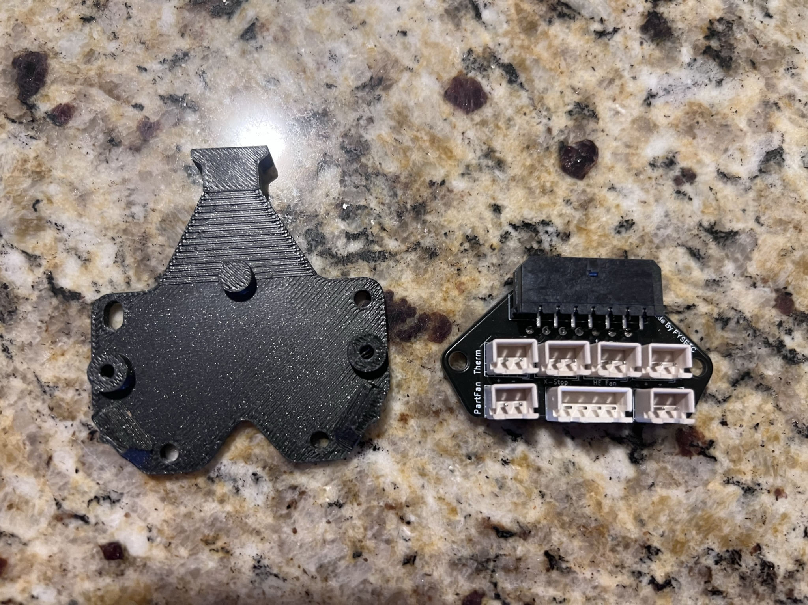
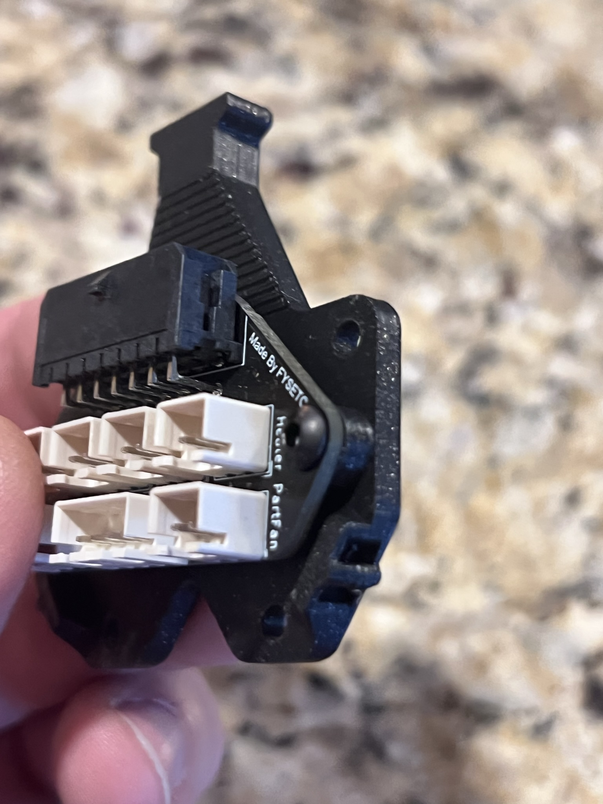

For the V0.2 a different backplate is needed. This drops the toolhead PCB a few mm making the fit better and giving better strain relief. Also added is some tie downs to assist in wire manamgnet. 

use 2 M3x6 BHCS to tap into the plastic, the rest of the default V0.2 motor backplate remains the same

 
 

