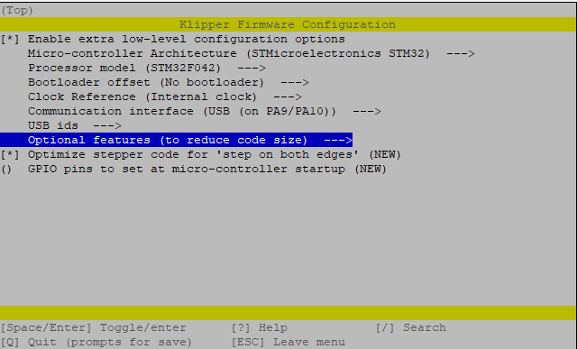
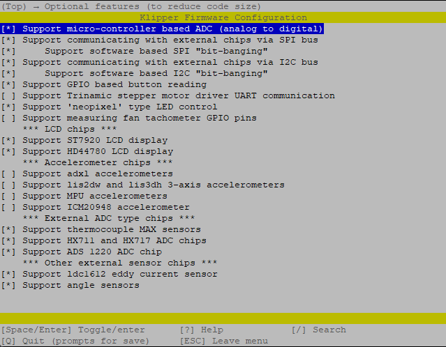

## V0 Display Flashing Instructions:

1) Connect the board to the host Raspberry Pi via USB.

2) This step depends on if your board has firmware on it or not already:

	a) If you have a pre-flashed board:
		-Install the boot jumper and reset the board. This will put the board into DFU mode.
	
	b) If you have an unflashed board:
		- The MCU default's to DFU mode if there is no other firmware installed.
		
	 - confirm the board enters DFU mode in step 4
	
3) Connect to your host raspberry pi via SSH

4) Run `lsusb` from the command prompt
	- Make sure you see an STM32 in DFU mode listed
	
5) Run `dfu-util --list` from the command prompt
	- note the text inside the [xxxx:yyyy]

6) Run `cd ~/klipper` from the command line to enter the Klipper directory

7) Run `make menuconfig` settings should be:

	

	- Set the "Optional features" to:

	

	- Hit `Q` to Exit and Save

8) Run `make clean` to clean up the make environment.

9) Run `make flash FLASH_DEVICE=xxxx:yyyy` (using xxxx:yyyy from above)
	- You may see what appears to be an "error" after flashing your board. (Blue box)
	- As long as you see the `File downloded successfully` text (Green box) you are good to proceed.
 	- The error (Red box) seems to be caused by the controller immediately running the uploaded code and no longer appearing as a DFU device. This is not an issue, as long as the board reports a Klipper serial name.
		

10) Remove the boot jumper and press the reset button.

11) After completion `ls /dev/serial/by-id/*` should return a device begining with `/dev/serial/by-id/usb-Klipper_stm32f042x6...` 

12) Copy this serial port name (`/dev/serial/by-id/usb-Klipper_stm32f042x6...` )and place it in your [mcu display] section of the display config file.

Your board should now be usable with Klipper. Use the example config file to get started
Best option is to copy the config file into the same directory as `printer.cfg` then add `[include V0Display.cfg]` to the end of your `printer.cfg` to include the file.
