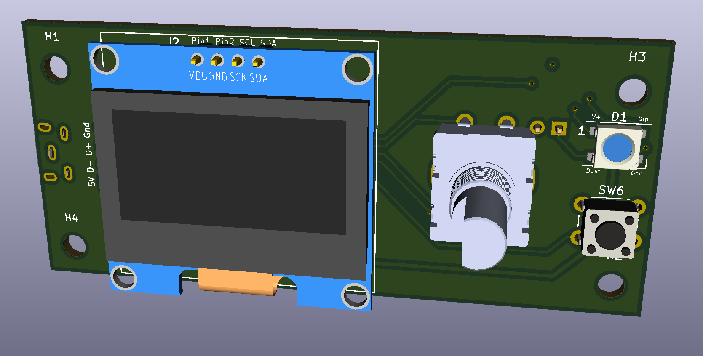

# V0 Display #

## The board has: ##
 - STM32F042F6P6 MCU with internal oscillator
 - SWD header for easy debugging
 - I2C Screen connections for both 1.3 and .9" Displays (Note the 3v3 and ground are changed as the boards usually have them swapped
 - 4 way button pad OR EN11-style click encoder support
 - Reset/kill button
 - 3 GPIO pin header
 - 1 on-board Neopixel with data line broken out for expansion
 - Dual USB port (Vertical or Horizontal)

## In addition to the PCB, you will need: ## 
 - [Encoder](https://www.amazon.com/DIYhz-Rotary-Encoder-Digital-Potentiometer/dp/B07D3D64X7) or [6mm Tactile buttons](https://www.amazon.com/Momentary-Tactile-Through-Breadboard-Friendly/dp/B07WF76VHT)
 - An OLED display [1.3"](https://www.amazon.com/HiLetgo-Serial-SSH1106-Display-Arduino/dp/B01MRR4LVE/) or [0.96"](https://www.amazon.com/gp/product/B01MQPQF24/)
 - Micro USB port (Horizontal [Molex 105017-0001](https://www.digikey.com/product-detail/en/molex/1050170001/WM1399CT-ND/2350885) or equivalent [Amazon](https://www.amazon.com/gp/product/B01IQ8VN94)) *or* (Vertical [Molex 105017-0001](https://www.digikey.com/product-detail/en/molex/1051330001/WM9734CT-ND/4037910))

### Optionally you can get: ###
- [Neopixels](https://www.digikey.com/products/en?mpart=1655&v=1528) or look on ebay for bare 5050 Neopixels
