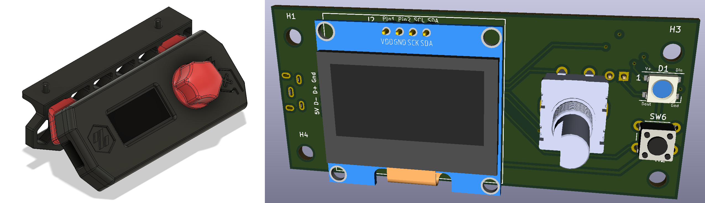

# V0 Display #

[Interactive bom](http://htmlpreview.github.io/?https://github.com/VoronDesign/Voron-Hardware/blob/master/V0_Display/Documentation/V0-Display_ibom.html)
## The board has: ##
 - STM32F042F6P6 MCU with internal oscillator
 - SWD header for easy debugging (not populated by default)
 - Dual USB port (Vertical or Horizontal) with breakout pin header for USB header
 - I2C Screen connections for  1.3" display with jumpers on back for slecting which pins (1 or 2) are power and ground
 - EN11-style click encoder support
 - Reset/kill button
 - 3 GPIO pin header
 - 1 on-board Neopixel with data line broken out for expansion
 
## In addition to the PCB and SMD parts (see BOM), you will need: ##
 - Encoder [Amazon](https://www.amazon.com/DIYhz-Rotary-Encoder-Digital-Potentiometer/dp/B07D3D64X7)/[DigiKey](https://www.digikey.com/product-detail/en/tt-electronics-bi/EN11-HSB1AF15/987-1186-ND/2408764) 
 - Kill and Reset Switch [6mm Tactile buttons 4.3mm Tall](https://www.amazon.com/BOJACK-Pushbutton-Switches-Momentary-Assortment/dp/B07ZBHXBZ4)
 - An OLED display [1.3"](https://www.amazon.com/HiLetgo-Serial-SSH1106-Display-Arduino/dp/B01MRR4LVE/)
 - Pin Header Assortment [Male Dupont-Style](https://www.amazon.com/MCIGICM-Header-2-45mm-Arduino-Connector/dp/B07PKKY8BX/ref=sr_1_3) and/or [JST-XH Style](https://www.amazon.com/GeeBat-460pcs-Connector-Housing-Adapter/dp/B01MCZE2HM/ref=sr_1_4) (Can be nice for USB as it's polorized)

### Optionally you can get: ###
- [Neopixels](https://www.digikey.com/products/en?mpart=1655&v=1528) or look on ebay for bare 5050 Neopixels
- Micro USB port (Horizontal [Molex 105017-0001](https://www.digikey.com/product-detail/en/molex/1050170001/WM1399CT-ND/2350885) or equivalent [Amazon](https://www.amazon.com/gp/product/B01IQ8VN94)) *or* (Vertical [Molex 105017-0001](https://www.digikey.com/product-detail/en/molex/1051330001/WM9734CT-ND/4037910))