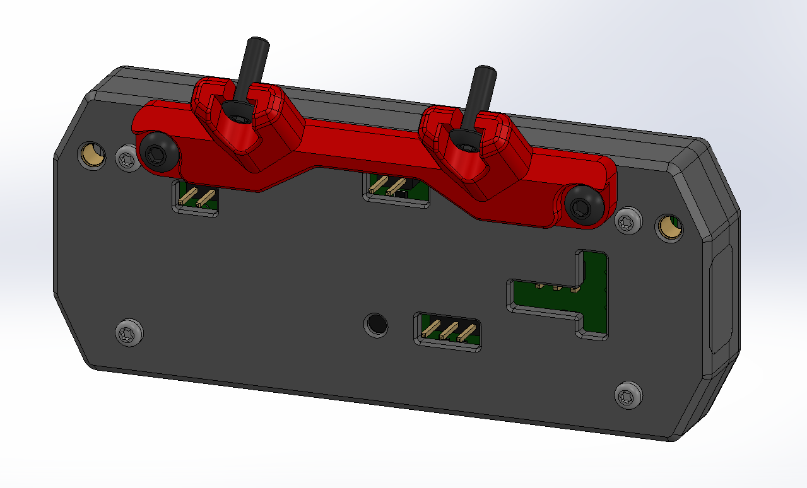

# V0 Display Enclosure #

Print *** either *** the standard version or `No_USB` depending on your use case. If you print the standard version you can print a `USB_Opening_Plug` if you have switched to using the pin header instead of the USB plug. If you have the `2*5 SWD header` installed print `Housing_Rear_SWD_x1.stl` instead of `Housing_Rear_x1.stl`.

In addition to the printed parts you will need:

- 4 x [M3 Heat set inserts (5x4x3)](https://www.aliexpress.com/item/4000232858343.html?spm=a2g0s.9042311.0.0.21164c4dGhWHhY)

- 4 x [M2\*12mm Self tapping screws](https://www.amazon.com/uxcell-Stainless-Phillips-Tapping-Screws/dp/B01L7PCWXO)

and

For the V0.0 you will need additional:

- 6 x [M3\*10mm bolts](https://www.amazon.com/Socket-Screws-Finish-Machine-Quantity/dp/B083F9GBSS) (Socket Head vs Button Head doesnt matter)for attaching the mount to the display and to the skirts.

For the V0.1 you will need additional:

- 2 x [M3\*10mm bolts](https://www.amazon.com/Socket-Screws-Finish-Machine-Quantity/dp/B083F9GBSS) (Socket Head vs Button Head doesnt matter)for attaching the mount to the skirts.

- 2 x [M3\*6mm bolts](https://www.amazon.com/Socket-Screws-Finish-Machine-Quantity/dp/B083FB2T8S) (Socket Head vs Button Head doesnt matter) for attaching the mount to the display.

