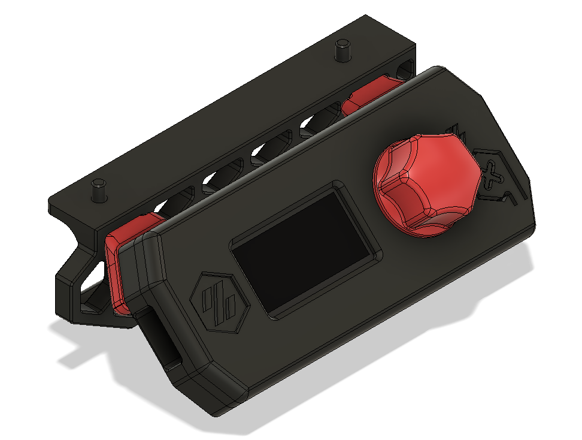

# V0 Display Enclosure #

In addition to the printed parts you will need:

6 x M3\*10mm bolts (Socket Head vs Button Head doesnt matter)
4 x M3 Heat set inserts (5x4x3)
4 x M2\*12mm Self tapping screws

** The Skirts in this folder are IDENTICAL to the skirts on the main V0 repo as of 6-27-2020.
** If you have printed skirts BEFORE this date please print the Left ***or*** Right version depending on which side you want top mount the screen on.
