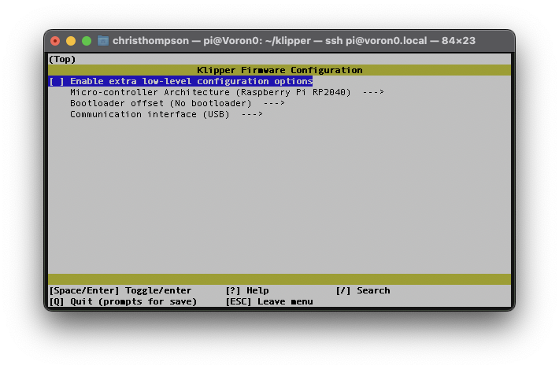

## V0 Display RP2040 Flashing Instructions:

1) Connect the board to the host Raspberry Pi via USB.

2) This step depends on if your board has firmware on it or not already:

	a) If you have a pre-flashed board:
		-Press and hold the boot button and reset the board. This will put the board into DFU mode.
	
	b) If you have an unflashed board:
		- The MCU will show up as a disk automatically if there is no other firmware installed.
		
	 - confirm the board enters disk mode in step 4
	
3) Connect to your host raspberry pi via SSH

4) Run `lsblk` from the command prompt
	- Make sure you see an new partition (run LSBLK once before and after connecing the display to determine which device to use, mine shows up as SDA1)
	

6) Run `cd ~/klipper` from the command line to enter the Klipper directory

7) Run `make menuconfig` settings should be:

	Exit and Save

8) Run `make clean` to clean up the make environment.

9) Run the following commands to copy the flash file to the Display (my display shows up as SDA1, yours may vary):
    `sudo mount /dev/sda1 /mnt`
    `sudo cp out/klipper.uf2 /mnt`
    `sudo umount /mnt`

10) Press the reset button on the back of the display.

11) After completion `ls /dev/serial/by-id/*` should return a device begining with `/dev/serial/by-id/usb-Klipper_rp2040...` 

12) Copy this serial port name (`/dev/serial/by-id/usb-Klipper_rp2040...` )and place it in your [mcu display] section of the display config file.

Your board should now be usable with Klipper. Use the example config file to get started

Best option is to copy the config file into the same directory as `printer.cfg` then add `[include voron0-2040-display.cfg]` to the end of your `printer.cfg` to include the file.
