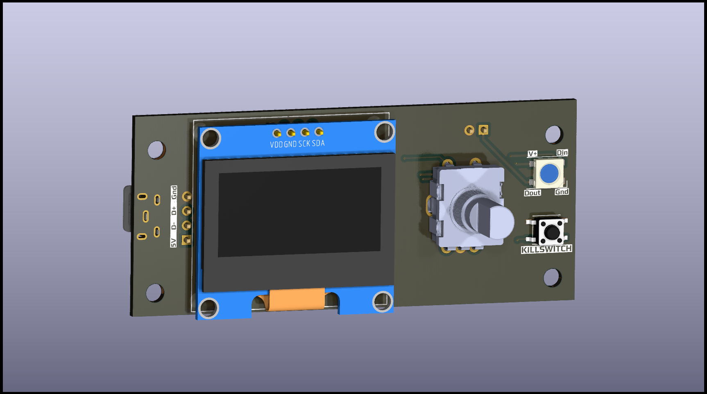

# V0 Display #

## The reason ##

The reason I built this board is because I had a very difficult time sourcing the original V0_Display, evidently the chips were in short supply. The best I could get was an already assembled unit from China, which did work
but I really wanted to find a more readily available option (and not wait 3 months again). Additionally, this was a challenge for me as I really enjoy in the creation and testing of hardware like this. 

Call out to everyone who contributed to the original V0 Display. I based my design on those original dimensions. -th0mpy

## The board has: ##
 - RP2040 chip with external oscillator and flash memory. 
 - SWD header (for troubleshooting purposes)
 - I2C Screen connections for 1.3" display
 - Dual USB port (Vertical or Horizontal) with breakout pin header for USB header
 - EN11-style click encoder support
 - Reset/kill button
 - 3 GPIO pin header
 - 1 on-board Neopixel with data line broken out for expansion
 
## In addition to the PCB and SMD parts (see the KiCad files), you will need: ##
 - Encoder [Amazon](https://www.amazon.com/DIYhz-Rotary-Encoder-Digital-Potentiometer/dp/B07D3D64X7)/[DigiKey](https://www.digikey.com/product-detail/en/tt-electronics-bi/EN11-HSB1AF15/987-1186-ND/2408764) 
 - An OLED display [1.3"](https://www.amazon.com/HiLetgo-Serial-SSH1106-Display-Arduino/dp/B01MRR4LVE/)
 - Pin Header Assortment [Male Dupont-Style](https://www.amazon.com/MCIGICM-Header-2-45mm-Arduino-Connector/dp/B07PKKY8BX/ref=sr_1_3) and/or [JST-XH Style](https://www.amazon.com/GeeBat-460pcs-Connector-Housing-Adapter/dp/B01MCZE2HM/ref=sr_1_4) (Can be nice for USB as it's polorized, you will burn out the display if you wire the USB header backwards)

### Optionally you can get: ###
- Micro USB port (Horizontal [Molex 105017-0001](https://www.digikey.com/product-detail/en/molex/1050170001/WM1399CT-ND/2350885) or equivalent [Amazon](https://www.amazon.com/gp/product/B01IQ8VN94)) *or* (Vertical [Molex 105017-0001](https://www.digikey.com/product-detail/en/molex/1051330001/WM9734CT-ND/4037910))

## Will work with Voron 0.2 enclosures ##

## !!!WARNING!!! ##

If you choose to use the USB pin header, instead of the usb connector PAY VERY CLOSE ATTENTION TO THE POLARITY. You WILL damage the board, and potentially the USB port if you wire it in backwards. Check, Re-check, double-check, and triple-check with a multimeter to make sure that your 5V and GND connections are connected properly. 

## Fully assembled and flashed units are available in the US and Europe through my Etsy shop, or from Lab4450.com store ##
[ETSY shop (only shipping to the US)](https://www.etsy.com/listing/1458617388/voron0-13-display-based-on-the-rp2040)
[Lab4450 (only shipping to the EU)](https://lab4450.com/product/voron-v02-rp2040-display/)
