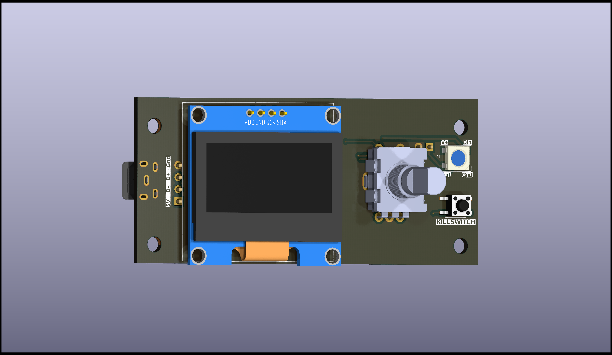

# V0 Display #

## The reason##

The reason I built this board is because I had a very difficult time sourcing the original V0_Display, evidently the chips were in short supply. The best I could get was an already assembled unit from China, which did work
but I really wanted to find a more readily available option (and not wait 3 months again). Additionally, this was a challenge for me as I really enjoy in the creation and testing of hardware like this. 

Call out to everyone who contributed to the original V0 Display. I based my design on those original dimensions. 

## The board has: ##
 - RP2040 chip with external oscillator and flash memory. 
 - SWD header (for troubleshooting purposes)
 - USB-C (2.0 standard) with breakout pin header for USB header
 - I2C Screen connections for 1.3" display
 - EN11-style click encoder support
 - Reset/kill button
 - 1 on-board Neopixel with data line broken out for expansion
 
## In addition to the PCB and SMD parts (see the KiCad files), you will need: ##
 - Encoder [Amazon](https://www.amazon.com/DIYhz-Rotary-Encoder-Digital-Potentiometer/dp/B07D3D64X7)/[DigiKey](https://www.digikey.com/product-detail/en/tt-electronics-bi/EN11-HSB1AF15/987-1186-ND/2408764) 
 - Kill, BOOTSEL, and Reset Switch [6mm Tactile buttons 4.3mm Tall](https://www.amazon.com/BOJACK-Pushbutton-Switches-Momentary-Assortment/dp/B07ZBHXBZ4)
 - An OLED display [1.3"](https://www.amazon.com/HiLetgo-Serial-SSH1106-Display-Arduino/dp/B01MRR4LVE/)
 - Pin Header Assortment [Male Dupont-Style](https://www.amazon.com/MCIGICM-Header-2-45mm-Arduino-Connector/dp/B07PKKY8BX/ref=sr_1_3) and/or [JST-XH Style](https://www.amazon.com/GeeBat-460pcs-Connector-Housing-Adapter/dp/B01MCZE2HM/ref=sr_1_4) (Can be nice for USB as it's polorized, you will burn out the display if you wire the USB header backwards)

## Will work with Voron 0.2 enclosures ##

## Fully assembled and flashed units are available in the US and Europe through my Etsy shop, or from Lab4450.com store ##
[ETSY shop (only shipping to the US)](https://www.etsy.com/listing/1458617388/voron0-13-display-based-on-the-rp2040)
[Lab4450 (only shipping to the EU)](https://lab4450.com/product/voron-v02-rp2040-display/)
