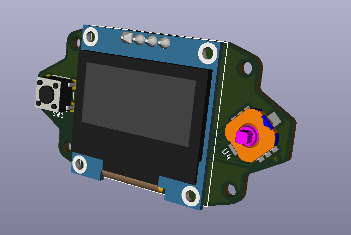

# V0-Micro Display

[Interactive bom](http://htmlpreview.github.io/?https://github.com/VoronDesign/Voron-Hardware/blob/master/V0_Micro_Display/InteractiveBOM.html)

Tiny display designed for the VORON Design V0:
 - STM32F042F6P6 MCU with internal oscilator
 - 0.96" OLED screen
 - 4-Way switch with button [(SKRHAAE010)](https://lcsc.com/product-detail/Multi-Directional-Switches_ALPS_SKRHAAE010_SKRHAAE010_C202423.html?currency=SEK)
 - Kill and Reset buttons
