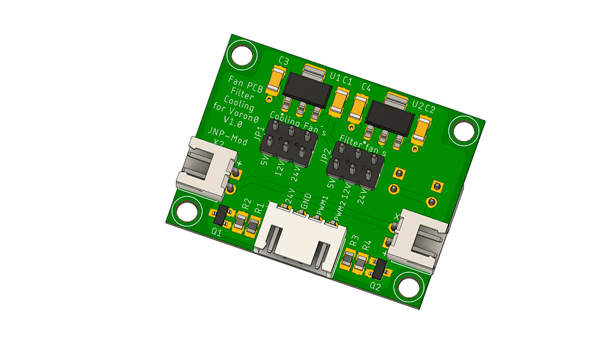
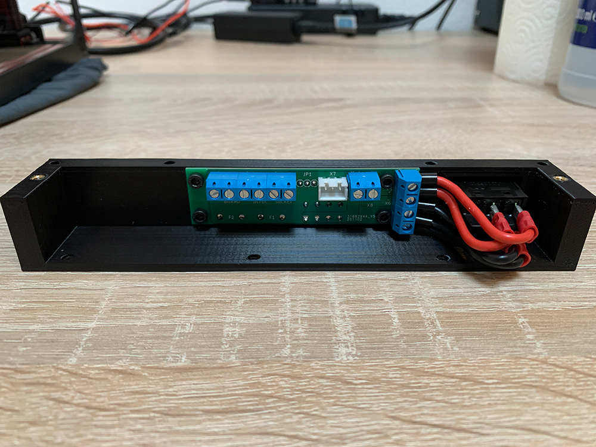

Be careful and take your time to assemble the boards.

The circuit boards were developed, built and tested in my own Voron0 printer by me.

I do not assume any guarantee or liability for mistakes made by others.

The replica is done at your own risk.

The circuit boards are for private use only

All parts can be obtained from Mouser or Digikey.

