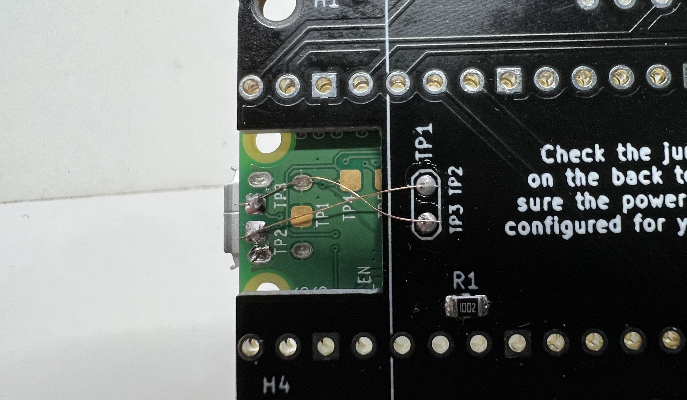
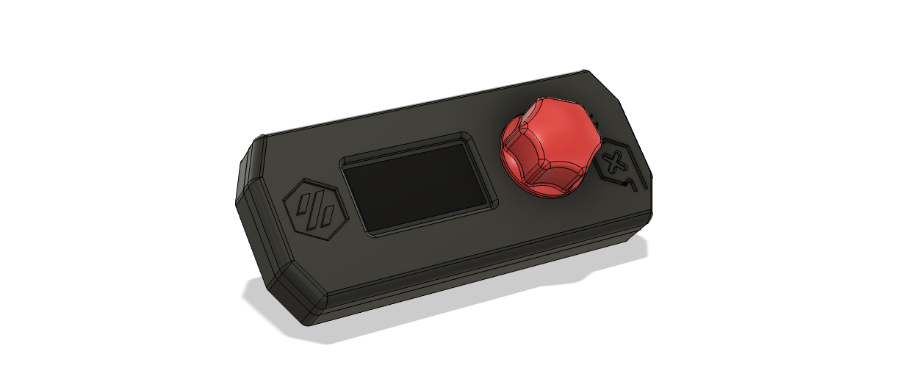

# V0 Pico Display


V0 Pico Display is based on original V0 Display by Timmit99 [here](../V0_Display/)

V0 Pico Display use Raspberry Pico board instead of STM32 mcu due to current shortage. Pico is easier to source, cheaper and well documented.

The board have:
- Connector to connect I2C 1.3 inch OLED screen, you can select GND and VCC for pin1 and pin2 on the back.
- EC11-style click encoder support
- USB port and URB header
- Reset/kill button
- Neopixel support

# Sourcing

## PCB

PCB can be sourced via JLCPCB. Use the following files for production:
- [Gerber](Production%20Files/Gerbers/Gerbers.zip)
- [BOM](Production%20Files/V0_Display.csv)
- [SMT top side](Production%20Files/V0_Display-top-pos.csv)

## Parts

- Raspberry Pico
- [EC11 Rotary Encoder](https://www.amazon.com/DIYhz-Rotary-Encoder-Digital-Potentiometer/dp/B07D3D64X7)
- [Kill and Reset Switch 6mm Tactile buttons 4.3mm Tall](https://www.amazon.com/BOJACK-Pushbutton-Switches-Momentary-Assortment/dp/B07ZBHXBZ4)
- [JST-XH Style Header](https://www.amazon.com/GeeBat-460pcs-Connector-Housing-Adapter/dp/B01MCZE2HM/ref=sr_1_4)

Optionals:

- [Neopixels](https://www.digikey.com/products/en?mpart=1655&v=1528) or look on ebay for bare 5050 Neopixels
- Pin Header [Male Dupont-Style](https://www.amazon.com/MCIGICM-Header-2-45mm-Arduino-Connector/dp/B07PKKY8BX/ref=sr_1_3) for Neopixel pin-out

## Soldering notes

To able to use USB header, connect TP2 TP3 on Pico and PCB by wire:


# STL parts



Due to the size of the Pico Board, the front and the rear of the case is little bit different. Check [STLs](STLs/) for compatible case.

# Flashing Firmware

Make sure to use the lastest Klipper version (at least v0.10.0-278).

Step 1: ssh to your raspberry pi

Step 2: navigate to `klipper` folder:

```
cd ~/klipper
```

Step 3: config firmware, should look like this:

```
[ ] Enable extra low-level configuration options
Micro-controller Architecture (Raspberry Pi RP2040)  --->
Communication interface (USB)  --->
```

Step 4: compile the firmware:

```
make clean; make
```

Step 5: make sure no other usb is connected to your Raspberry Pi. Connect Pico to your Raspberry Pi while holding boot button down.

Step 6: copy firmware to your Pico (assuming you have no other USB drives and the Pico registers as /dev/sda):

```
sudo mount /dev/sda1 /mnt
sudo cp out/klipper.uf2 /mnt
sudo umount /mnt
```

After that, the Pico will automatically reboot, reflash itself, then re-register for use (no need to unplug/replug).

# Klipper config

Copy [V0PICODisplay.cfg](Software/V0PICODisplay.cfg) to your Klipper config folder (using web interface).
Then add this line to your `printer.cfg`:

```
[include V0PICODisplay.cfg]
```

Save & Restart