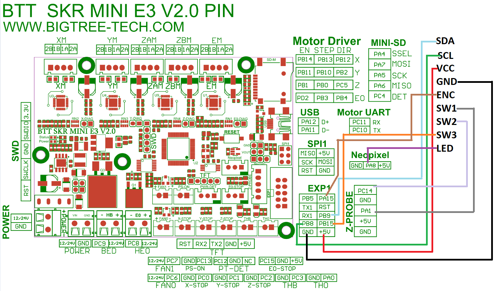

# V0 Simple Screen   #

# Wiring Diagram #
## This is diagam works for all revisions but rev2 can now also connect using a 10pin ribbon directly to the SKR mini e3 v2

## for Rev2 if you are using an SKR mini e3 v2 you can connect it directly to the EXP1 header on the MCU 

## The board was designed to be a cheaper alternative to the V0 Display by Timmit: ##
this board doesnt have any MCU on it and connects directly to the printers controller board over I2c 

 ### BOM
Item | QTY | Link
--- | --- | ---
1.3" I2C OLED  | 1 | https://www.amazon.com/Teyleten-Robot-Display-Raspberry-Microcontroller/dp/B08J1D212N
JST Connectors 2P,3P,4P | 1 | https://www.amazon.com/Hilitchi-Housing-Connector-Adapter-Perfectly-Compatible/dp/B015Y6JOUG
IDC 10Pin Shrouded Header | 2 | https://lcsc.com/product-detail/IDC-Connectors_BOOMELE-Boom-Precision-Elec-C5665_C5665.html
Rotary Encoder | 1 | https://www.amazon.com/DIYhz-Rotary-Encoder-Digital-Potentiometer/dp/B07D3D64X7
Momentary tactile Switch | 1 | https://www.amazon.com/QTEATAK-Momentary-Tactile-Button-Switch/dp/B07VSNN9S2 
PCB Ordered/assembled from JLCPCB | 1 | https://jlcpcb.com/
SchmittTrigger Buffer | 1 | https://lcsc.com/product-detail/Buffers---Drivers_Texas-Instruments-SN74LVC1G17DBVR_C7836.html
WS2812B LED | 1 | https://lcsc.com/product-detail/Light-Emitting-Diodes-LED_Worldsemi-WS2812B-B_C114586.html

 ## Config for SKR Mini E3 V2.0 Rev1
    ################################
    ####  Simple Screen Config  ####
    ################################
    [display]
    lcd_type: sh1106
    click_pin: ^!PA15
    i2c_bus: i2c1a
    i2c_mcu = mcu
    encoder_pins: ^PA1, ^PC14
    kill_pin: ^!PB15
    vcomh: 60
    x_offset: 2
    
    [neopixel display_led]
    pin: PA8
    color_order: GRB
    initial_RED: 0.5
    initial_GREEN: 0.5
    initial_BLUE: 0.5
    
    #sda = pb9
    #scl = pb8

 ## Config for SKR Mini E3 V2.0 Rev2
    ################################
    ####  Simple Screen Config  ####
    ################################
    [display]
    lcd_type: sh1106
    click_pin: ^!PA15
    i2c_bus: i2c1a
    i2c_mcu = mcu
    encoder_pins: ^PA10, ^PA9
    kill_pin: ^!PB15
    vcomh: 60
    x_offset: 2
    
    [neopixel display_led]
    pin: PB5
    color_order: GRB
    initial_RED: 0.5
    initial_GREEN: 0.5
    initial_BLUE: 0.5
    
    #sda = pb9
    #scl = pb8
